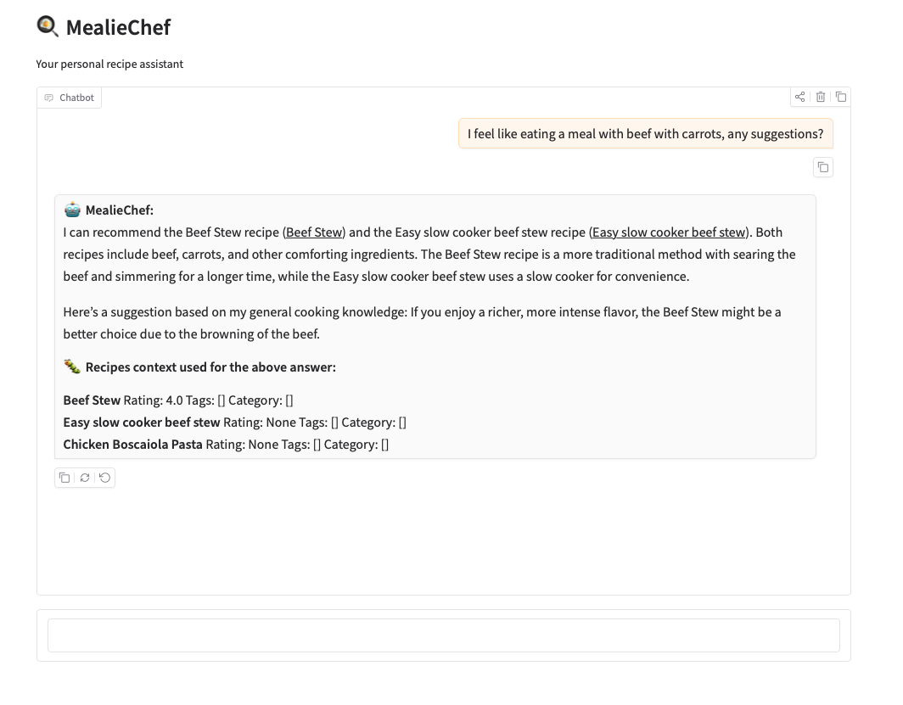

# [WIP] Mealie RAG PoC

## Overview

Contains a Proof of Concept (PoC) for a Retrieval-Augmented Generation (RAG) system built on top of [Mealie](https://mealie.io/). It allows users to chat with their recipes!

Currently, it uses (may change in the future):
- **Mealie**: Source of recipe data.
- **Qdrant**: Vector database for storing recipe embeddings.
- **Ollama**: Local LLM and embedding provider.
- **Typer**: CLI for managing ingestion and interaction.
- **Gradio**: Web UI for the database chat.

... Now go to [src/mealierag/README.md](src/mealierag/README.md).
