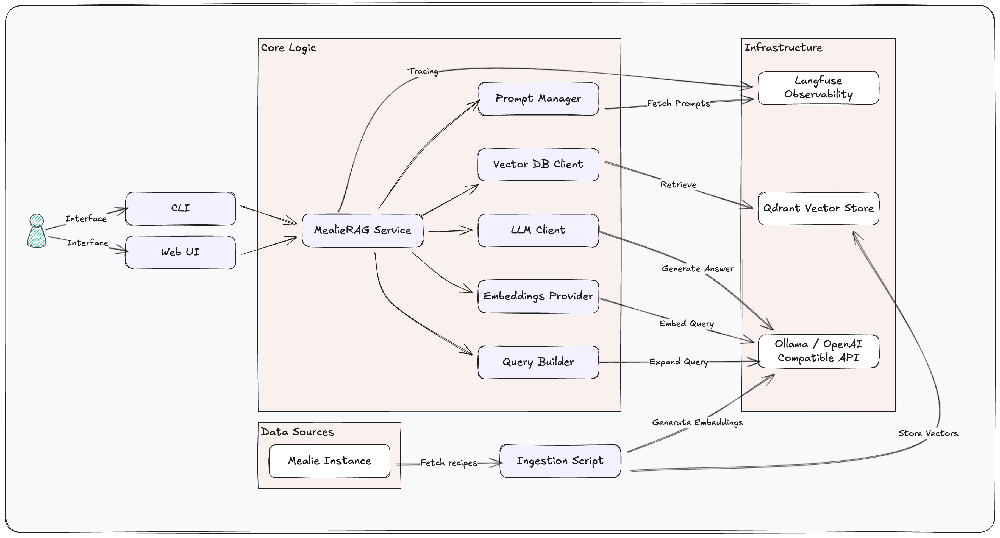

# Mealie RAG

## Overview

**Mealie RAG** is a Retrieval-Augmented Generation (RAG) system built as a companion to [Mealie](https://mealie.io/). It acts as a culinary assistant ("MealieChef"), allowing users to interact with their personal recipe collection using natural language!

I use this project as an **engineering sandbox** to explore the challenges of operationalizing GenAI systems. It moves beyond simple prototypes to explore the engineering challenges of building observable, reliable, and structured RAG pipelines. As such... ⚠️ Things may break or pivot significantly without notice!

## Current Architecture

## Engineering Highlights

*   **Advanced Retrieval Strategies**: Implements **Structured Query Extraction**, **Multi-Query Expansion**, and **Reciprocal Rank Fusion (RRF)** to filter and rank results.
*   **End-to-End Observability**: Integration with **Langfuse** for tracing execution paths, managing prompts versions, and tracking model usage/costs.
*   **Data Infrastructure**: Integration with **Qdrant** for efficient vector operations.
*   **Reproducibility & Standards**:
    *   **Modern Tooling**: managed via `uv` (dependency resolution) and `mise` (tool versioning).
    *   **Code Quality**: Enforced via strict typing, `ruff` linting/formatting, and pre-commit hooks.

## Technology Stack

*   **Core Application**: Python, Typer (CLI), Gradio (Web UI)
*   **Inference & Storage**: Qdrant, OpenAI SDK / Ollama (Code-level abstraction for Ollama/OpenAI)
*   **Observability**: Langfuse
*   **Infrastructure**: Docker Compose, GitHub Actions
